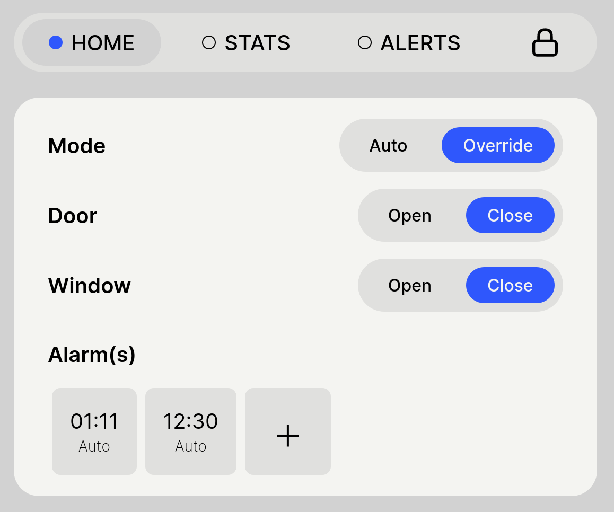
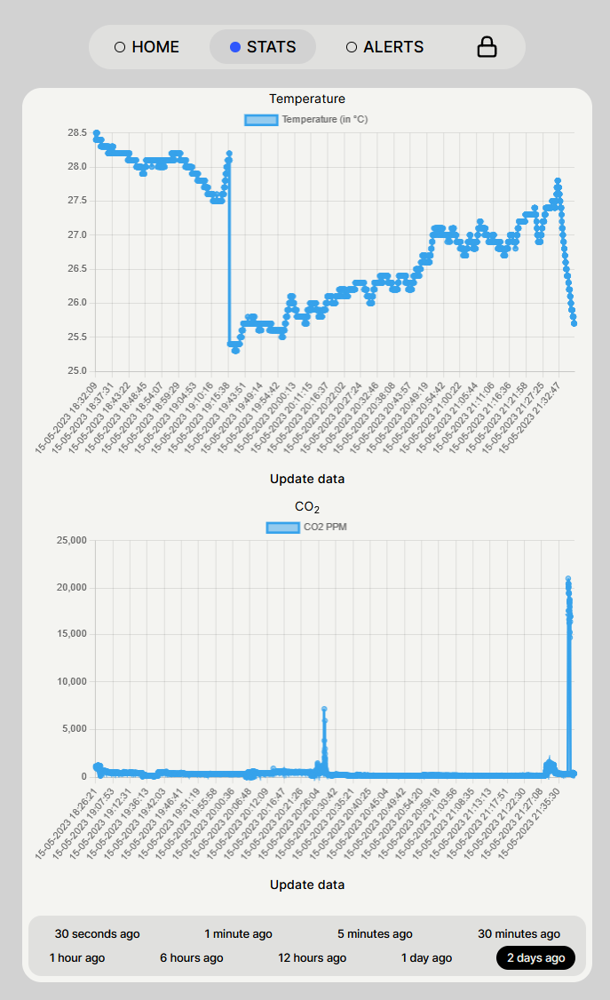
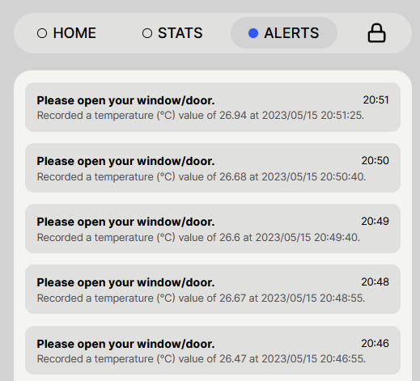
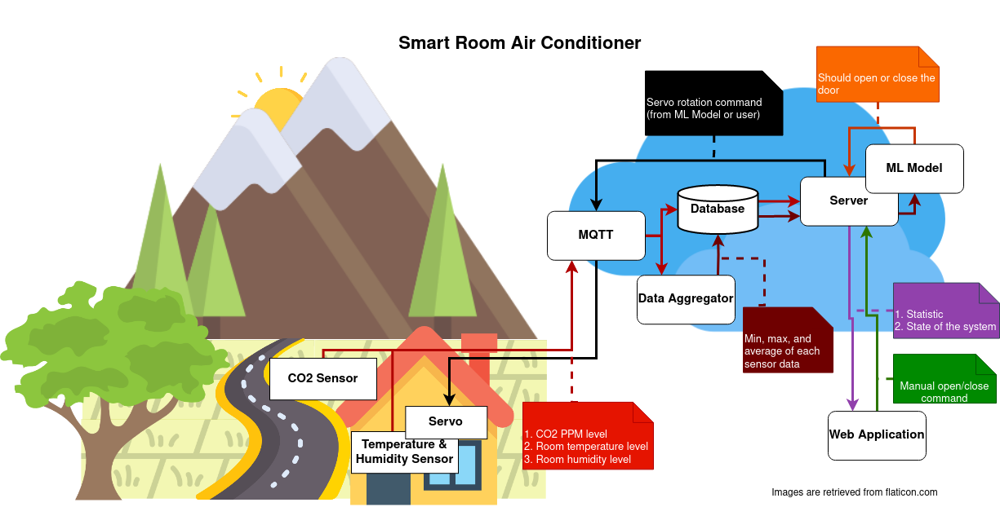
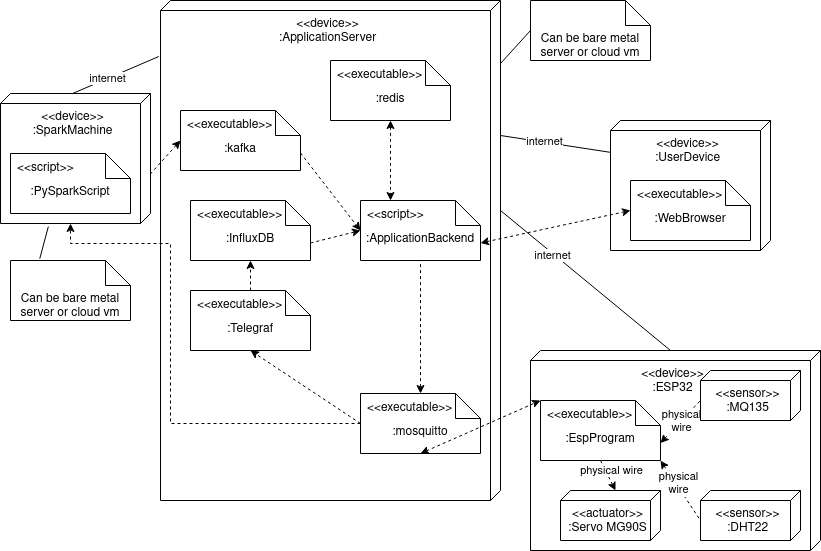

# IF4051 Final Project 
Air quality is an important aspect of a room. It affects the health, comfort, and productivity of the occupants. This paper presents an Internet-of-Things based system that can be used to monitor the air quality of a room and the outside air, and control the door/window of the room in hope of achieving a better air quality. The system will be able to monitor the air quality of a room, with temperature and humidity as the indicators, using DHT22 sensor; and the outside, with carbon dioxide (CO2) ppm as the indicator, using MQ135 sensor; and ESP32 as the microprocessor. The system also utilizes Time Series KMeans (TSKM) to determine the quality of the indicators, to decide whether to open or close the door.

<strong> TL;DR\
IoT System that make a room's air condition better by controlling the door(s)/window(s). \
Utilizes machine learning (TimeSeriesKMeans) to determine the door(s)/window(s)'s open/close. \
Indicator(s):
1. Inside: Temperature and Humidity, uses DHT22 sensor
2. Outside: Carbon dioxide, uses MQ135 sensor   
</strong>

## Features
### 1. Home View
System control: change AI/manual mode, remote control.
  > :warning: Alarm(s) feature is not developed.

### 2. Stats View
See realtime statistic of air condition. \

### 3. Alerts View
See alerts from AI of the air condition. \

## Technologies Used:
1. Web Application:
    1. Frontend: Vue 3, TypeScript, Vite; TailwindCSS
    2. Backend: FastAPI, Python 3; Redis; InfluxDB
    3. Protocol: REST API; WebSocket
2. Data Pipeline/Messaging Queue: MQTT; Kafka; PySpark
3. Embedded:
    1. Components: ESP32; MQ135; DHT22
    2. Code: C++; platformio
5. Machine Learning: TimeSeriesKMeans (tslearn; Python 3)
6. Containerization: Docker

## Distribution of Tasks
| Name | Student ID | Tasks |
|---|---|---|
| Josep Marcello | 13519164 | 1. Define system architecture 2. Calibrate sensors 3. Setup application and ESP32 boilerplate code 4. Setup infrastructure (including MQTT, InfluxDB, Telegraf, and Redis) 5. Connect ESP32 with time server 6. Develop ESP32 so it's able to control actuator and send sensor data at the same time 7. Establish connection between ESP32 and application through MQTT 8. Develop servo toggle feature (back-end) 9. Develop state manager for application back-end 10. Develop e-email notification and API to get all sent notifications 11. Develop simple app password system 12. Develop (almost realtime) statistics feature 13. Develop realtime data feature 14. Integrate ML model to web app 15. Setup docker for infrastructure and application 16. Code review 17. Server donation |
| Jeremia Axel B. | 13519188 | 1. Define early data pipeline architecture 2. Develop MQTT-PySpark for data aggregation 3. Develop mode toggle feature 4. Develop servo toggle feature (front-end) 5. Develop websocket to publish current state to front-end clients 6. Implement and train ML model 7. Save and use ML model in application's back-end 8. Initiate paper template (with sliced components) 9. Setup docker for data-pipeline and initial docker-compose 10. Create Google Slides for progress report 11. Code review |
| Jeane Mikha E. | 13519116 | 1. Determine ML algorithm to use 2. Design wireframe for web app's UI/UX 3. Enhance UI/UX of the web app 4. Develop alerts page 5. Edit demo video 6. Create poster |

## Diagram(s)
1. IoT Diagram \
    
2. Deployment Diagram \
    
